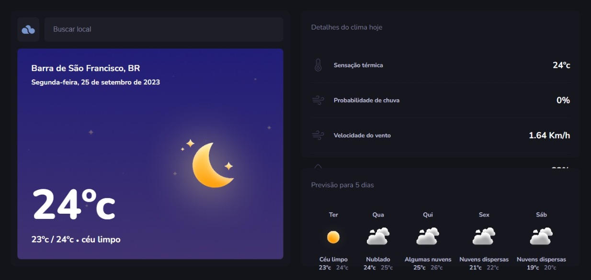

# TypeWeather 🚀

TypeWeather permite aos usuários pesquisar o nome de uma cidade e, em resposta, fornece uma série de dados meteorológicos importantes.

Com a simples inserção do nome da cidade na barra de pesquisa, você terá acesso a informações valiosas, como a temperatura atual, a temperatura mínima e máxima previstas, a sensação térmica, a probabilidade de chuva, a velocidade do vento, a umidade do ar, o índice UV e a previsão do tempo para os próximos 5 dias.

<b>Abaixo, temos uma demostração da aplicação</b>

  

No final do curso Explorer, temos um módulo que nós permite compreender e entender como aplicar TypeScript em um projeto. Nesse módulo, abordamos os conceitos fundamentais de TypeScript e seu uso na implementação de projetos JavaScript.

Foi explorado tópicos como: tipagens, tipos primitivos, criação de tipagens personalizadas, interfaces, types, generics, e a aplicação de tipos de objetos,  funções e componentes.

## Contact

- [LinkedIn](https://www.linkedin.com/in/henrique-thomazin-068922162/)